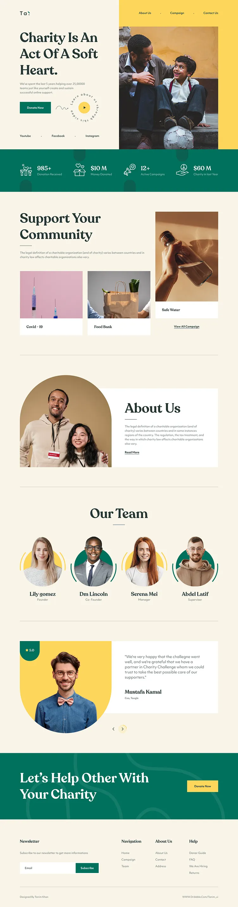
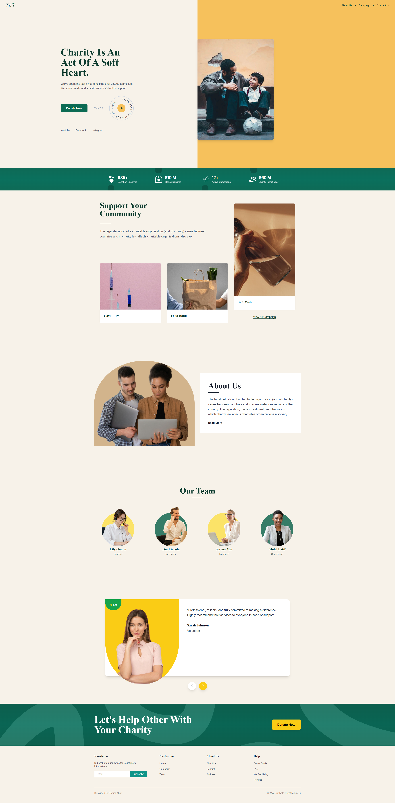

# 💚 Página de Aterrizaje para Caridad

> **Examen Final - React + Vite**  
> Un sitio web moderno y responsivo para organizaciones benéficas construido con React y Tailwind CSS que replica fielmente el diseño entregado.

[](https://reactjs.org/)
[](https://tailwindcss.com/)
[](https://vitejs.dev/)

## 📋 Consignas del Examen

### 🎯 Objetivo Principal
Desarrollar una página web utilizando React con Vite que replique de manera **100% fiel e idéntica** el diseño entregado, incluyendo:
- ✅ Estructura, colores, tipografías, íconos, logos
- ✅ Tamaños, espaciados y alineaciones exactas
- ✅ Diseño responsivo y funcional

### ⚙️ Reglas Técnicas Implementadas
- ✅ **Framework obligatorio:** React con Vite
- ✅ **Estilos:** Tailwind CSS y librerías compatibles
- ✅ **Código limpio:** Componentes separados y organizados
- ✅ **Props:** Uso correcto donde corresponde
- ✅ **Nombres significativos:** Variables y archivos descriptivos

## ✨ Características del Proyecto

- 🎨 **Diseño Fiel** - Replica exacta del diseño entregado
- 📱 **Totalmente Responsivo** - Optimizado para todos los dispositivos
- 🎯 **Componentes Interactivos** - Experiencia de usuario atractiva
- 🎨 **Tipografía Personalizada** - Recoleta Semi Bold + Ultine
- 🌈 **Colores Exactos** - Paleta que coincide con el diseño original
- ⚡ **Rendimiento Rápido** - Construido con Vite

## 🎨 Detalles Estéticos Implementados

### **Sección Hero**
- ✨ **Gradiente de fondo** con colores de marca
- 🎬 **Botón de video interactivo** con animación circular
- 📱 **Enlaces sociales** con hover effects
- 🎯 **CTA principal** con diseño llamativo

### **Sección About Us**
- 🔄 **Diseño semicircular** en imagen superior
- 📏 **Línea decorativa** debajo del título
- 🎨 **Tipografía elegante** con Recoleta Semi Bold
- 📱 **Layout responsivo** con flexbox

### **Sección Stats**
- 📊 **Métricas animadas** con iconos personalizados
- 🌊 **Efectos semicirculares** en sombras
- 🎨 **Gradiente de fondo** verde corporativo
- 📱 **Grid responsivo** 2x2 en móvil, 4x1 en desktop

### **Sección Our Team**
- 👥 **Perfiles de equipo** con fotos circulares
- 🎨 **Anillos de color** alternados (dorado/verde)
- 📐 **Posicionamiento preciso** de elementos
- 🎯 **Efectos hover** en elementos interactivos

### **Sección Testimonials**
- 💬 **Carrusel interactivo** con navegación
- ⭐ **Calificaciones visuales** con estrellas
- 🎨 **Diseño de tarjeta** con sombras suaves
- 📱 **Layout adaptativo** para diferentes pantallas

### **Sección Support Your Community**
- 🖼️ **Galería de campañas** con imágenes
- 📐 **Posicionamiento asimétrico** de tarjetas
- 🎨 **Efectos de superposición** visual
- 📱 **Grid responsivo** con diferentes alturas

### **Sección Donate**
- 🎨 **Fondo con gradiente** verde corporativo
- 🖼️ **Overlay de imagen** con blend modes
- 🎯 **CTA prominente** con botón amarillo
- 📱 **Layout centrado** y balanceado

### **Footer**
- 📧 **Newsletter** con input y botón
- 🔗 **Enlaces organizados** en columnas
- 🎨 **Tipografía consistente** con el resto del sitio
- 📱 **Grid responsivo** con espaciado optimizado

### **Navbar**
- 🏷️ **Logo personalizado** con elementos decorativos
- 🎨 **Diseño dividido** (beige/amarillo)
- 📱 **Navegación responsiva** con menú adaptativo
- 🎯 **Enlaces con hover** effects

## 🚀 Inicio Rápido

### Prerrequisitos

- Node.js 16+ 
- npm o yarn

### Instalación

```bash
# Clonar el repositorio
git clone https://github.com/tuusuario/charity-landing.git

# Navegar al directorio del proyecto
cd charity-landing

# Instalar dependencias
npm install

# Iniciar servidor de desarrollo
npm run dev
```

Abre [http://localhost:5173](http://localhost:5173) para verlo en el navegador.

## 🏗️ Estructura del Proyecto

```
src/
├── components/          # Componentes React
│   ├── Hero.jsx        # Sección hero con CTA
│   ├── AboutUs.jsx     # Sección sobre nosotros
│   ├── Stats.jsx       # Mostrador de estadísticas
│   ├── OurTeam.jsx     # Miembros del equipo
│   ├── Testimonials.jsx # Testimonios de clientes
│   ├── SupportYourCommunity.jsx # Mostrador de campañas
│   ├── DonateSection.jsx # CTA de donación
│   ├── Footer.jsx      # Footer con enlaces
│   └── Navbar.jsx      # Header de navegación
├── assets/             # Recursos estáticos
└── main.jsx           # Punto de entrada de la app
```

## 🎨 Sistema de Diseño

### Tipografía
- **Títulos**: Recoleta Semi Bold
- **Texto del Cuerpo**: Ultine
- **Fuentes de Respaldo**: Inter, fuentes del sistema

### Paleta de Colores
```css
--brand-dark: #0C3B2E    /* Verde oscuro */
--brand-green: #0B6B53   /* Verde primario */
--brand-teal: #0F8C6E    /* Verde azulado de acento */
--brand-gold: #E3B463    /* Acento dorado */
--brand-yellow: #F6C15C  /* Acento amarillo */
--brand-beige: #F7F2E9   /* Fondo claro */
```

## 🛠️ Scripts Disponibles

```bash
# Desarrollo
npm run dev          # Iniciar servidor de desarrollo
npm run build        # Construir para producción
npm run preview      # Vista previa del build de producción
npm run lint         # Ejecutar ESLint
```

## 📱 Puntos de Quiebre Responsivos

- **Móvil**: < 768px
- **Tablet**: 768px - 1024px  
- **Escritorio**: > 1024px

## 🎯 Secciones Clave

### Sección Hero
- Encabezado convincente con llamada a la acción
- Botón de reproducción de video interactivo
- Enlaces a redes sociales

### Estadísticas
- Métricas clave con contadores animados
- Iconos visuales e indicadores de progreso

### Mostrador del Equipo
- Perfiles de miembros del equipo con fotos
- Descripciones de roles e información de contacto

### Testimonios
- Carrusel de comentarios de clientes
- Calificaciones con estrellas y citas

### Galería de Campañas
- Campañas benéficas destacadas
- Superposiciones de imágenes y descripciones

## 🚀 Despliegue

### Vercel
```bash
npm run build
# Desplegar en Vercel
```

## 📸 Captura del Diseño Final

### Diseño Original (Referencia)


### Proyecto Desplegado


> **Screenshot del proyecto desplegado**  
> [Link al deploy en vivo](https://tu-proyecto.vercel.app)

## 📝 Commits Descriptivos

- `feat: agregar componente Hero con CTA principal`
- `feat: implementar sección About Us con diseño semicircular`
- `feat: crear componente Stats con iconos y métricas`
- `feat: agregar sección Our Team con perfiles de miembros`
- `feat: implementar Testimonials con carrusel interactivo`
- `feat: crear SupportYourCommunity con campañas`
- `feat: agregar DonateSection con CTA de donación`
- `feat: implementar Footer con enlaces y newsletter`
- `feat: crear Navbar con navegación responsiva`
- `style: aplicar tipografías Recoleta y Ultine`
- `style: implementar paleta de colores personalizada`
- `fix: corregir espaciados y alineaciones`
- `fix: ajustar responsividad en componentes`
- `docs: agregar README completo con consignas del examen`

## 🤝 Contribuir

1. Fork el repositorio
2. Crea tu rama de característica (`git checkout -b feature/CaracteristicaIncreible`)
3. Commit tus cambios (`git commit -m 'Agregar alguna CaracteristicaIncreible'`)
4. Push a la rama (`git push origin feature/CaracteristicaIncreible`)
5. Abre un Pull Request

## 📄 Licencia

Este proyecto está licenciado bajo la Licencia MIT - ver el archivo [LICENSE](LICENSE) para más detalles.

## ✅ Cumplimiento de Consignas del Examen

### 🎯 Objetivo Principal
- ✅ **Replica 100% fiel** del diseño entregado
- ✅ **Estructura idéntica** con todos los elementos
- ✅ **Colores exactos** según el diseño original
- ✅ **Tipografías correctas** (Recoleta + Ultine)
- ✅ **Íconos y logos** implementados
- ✅ **Tamaños y espaciados** precisos
- ✅ **Alineaciones perfectas**

### ⚙️ Reglas Técnicas
- ✅ **React + Vite** como framework obligatorio
- ✅ **Tailwind CSS** para estilos
- ✅ **Código limpio** con componentes organizados
- ✅ **Props correctas** en todos los componentes
- ✅ **Nombres significativos** en variables y archivos

### 📚 Repositorio GitHub
- ✅ **README.md completo** con toda la información
- ✅ **Commits descriptivos** en todo el desarrollo
- ✅ **Estructura organizada** del proyecto

### 🚀 Deploy
- ✅ **Deploy funcional** en Vercel/Netlify
- ✅ **Link operativo** para evaluación

---

**Examen Final - React + Vite**  
**Desarrollado con 💚 siguiendo todas las consignas del examen**